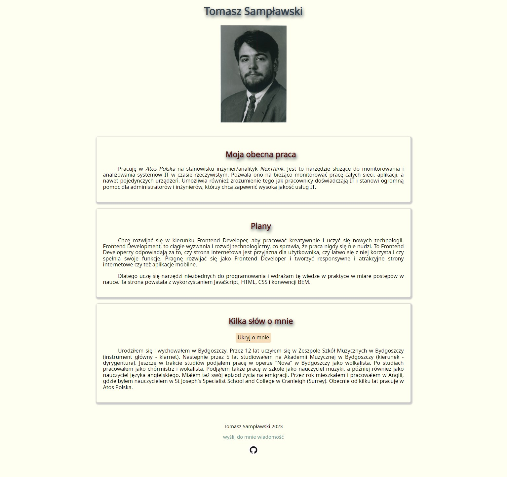

# Tomasz Sampławski - homepage
a few words about me

You can visit the page under this [LINK](https://samplawski.github.io/homepage/)

This repository contains the code for my first personal website.
## Table of contents
1. General info
2. Technologies
3. Setup
4. Features
5. Status and Contributing
6. Contact

## 1. General info

This website is my personal project, which aims to showcase my skills and experience as a Frontend Developer. The website contains information about my current work, future plans and a short biography.
## 2. Technologies

The website is created with:
- HTML5
- CSS
- JavaScript
- BEM methodology
- Normalize.css version 8.0.1

## 3. Setup

To run this project, clone the repository and open the index.html file in your browser. You can follow the below instructions.

In bash terminal paste:

$ git clone https://github.com/samplawski/homepage.git

$ cd homepage

$ open index.html  

## 4. Features

The main features of the website are:

- Responsive design, optimized for all screen sizes
- Modern, clean and professional design
- Interactive button that reveals additional information about me
- I use BEM methodology for easy-to-read and scalable CSS
- I included Normalize.css to ensure consistent cross-browser rendering
- Semantic HTML markup for better accessibility and search engine optimization

## 5. Status and Contributing

The project was created by Tomasz Sampławski. It is currently completed but may be updated in the future. Contributions are welcome and appreciated! 

Feel free to use it for your own projects or modify it to suit your needs.
## 6. Contact

If you want to contact me you can reach me at tsamplawski@gmail.com.
